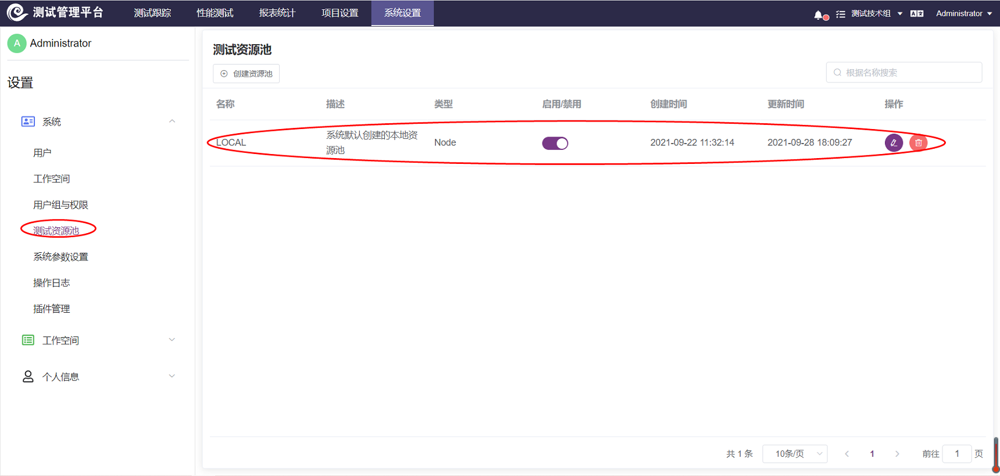
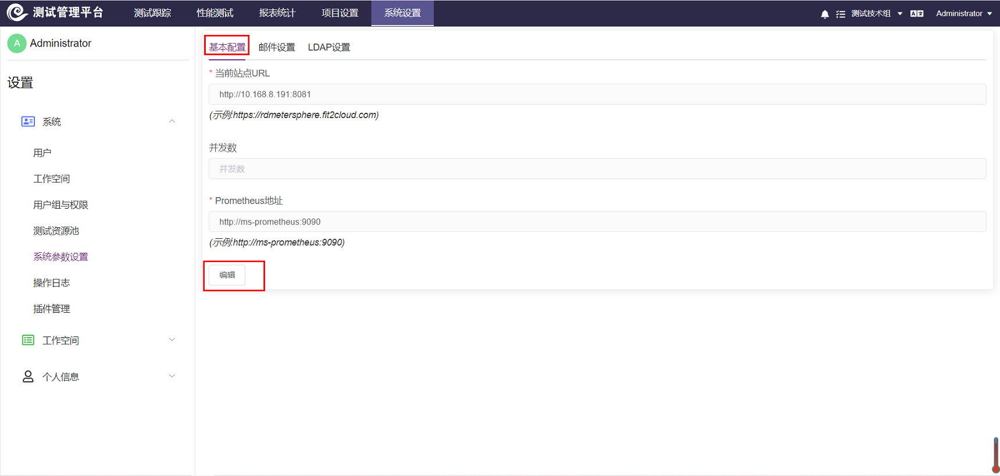
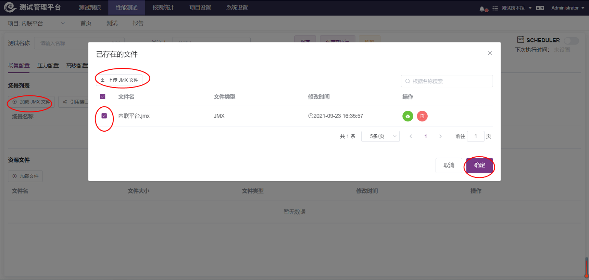
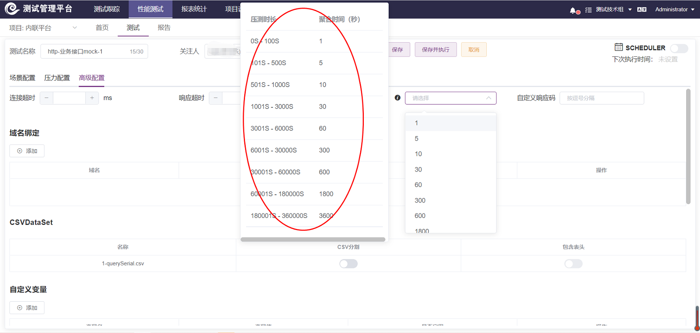
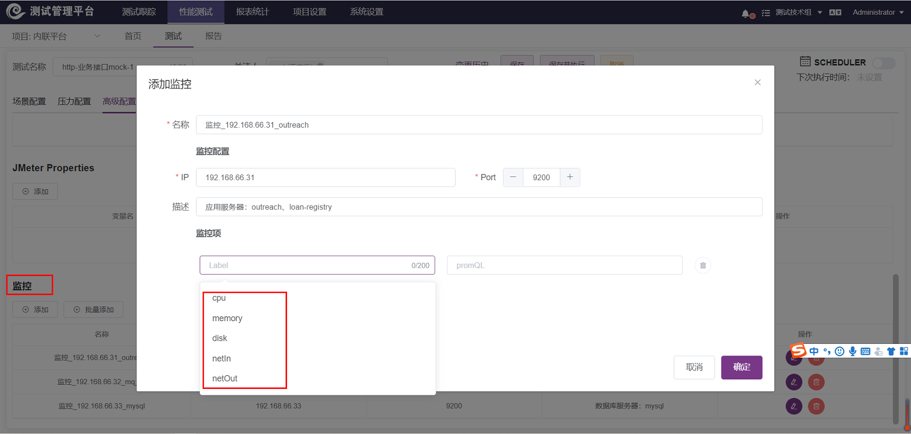

测试管理平台 性能测试模块支持用户通过已有的接口测试创建或直接上传 JMX 脚本来创建性能测试，并按需调整并发用户数等压力参数。

## 创建测试资源池

通过安装包安装 测试管理平台 后，系统默认使用当前节点创建了名为 `LOCAL` 测试资源池。关于测试资源池的作用请参考 [FAQ](../faq/load_test.md#_1)。

如果需要创建新的测试资源池，或向已有资源池中添加节点，请参考 [如何向测试资源池中添加节点？](../faq/load_test.md#_2)

## 修改当前站点 URL

性能测试执行过程中 node-controller 节点需要通过配置的 `当前站点URL` 下载 JMX 等测试资源文件。在执行性能测试前需要配置并检查测试资源池中的节点可以正常访问到该 URL，URL 值一般为通过浏览器访问 MeterSphere 的地址。

## 创建性能测试

进入 `性能测试`--`测试` 页面。

在性能测试列表中点击 `创建性能测试`，在 `场景配置` 点击 `加载JMX文件`，将压测脚本添加到性能测试中。

## 场景配置

## 压力配置
在压力配置页面选择系统自带的 `NODE-LOCAL` 测试资源池。

点击展开第一个线程组的配置页面，填入并发参数。

具体的并发配置如下：

- 并发用户数：10

- 选择 `按持续时间` 模式

- 压测时长：5分钟

- RPS 上限不设置

- 在 5秒内分 5步增加并发用户

## 高级配置

- 聚合时间配置

聚合时间表示，每次记录结果的时间间隔。会根据压测时间自动设置聚合时间。 也可手动设置。

- 监控配置

## 执行并查看报告

点击性能测试配置页面的 `保存并执行` 按钮，系统自动进入性能测试测试报告页面。当收到测试结果数据后，报告页面将自动更新。

