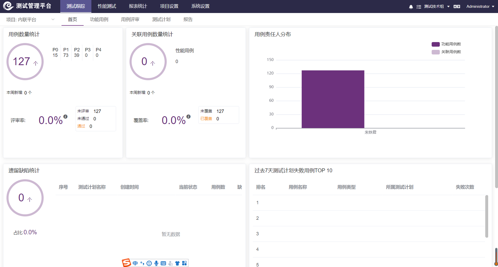
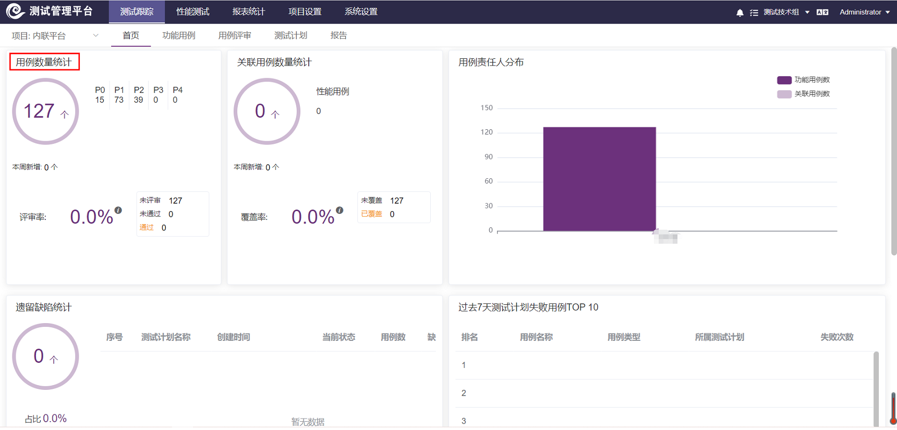
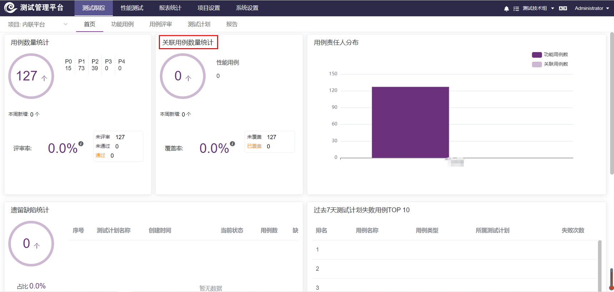
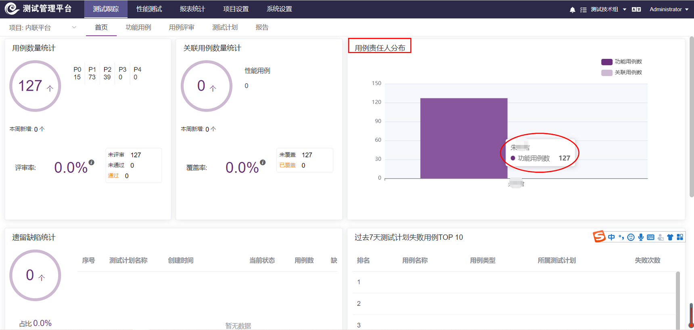
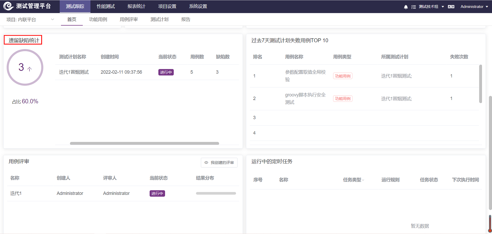
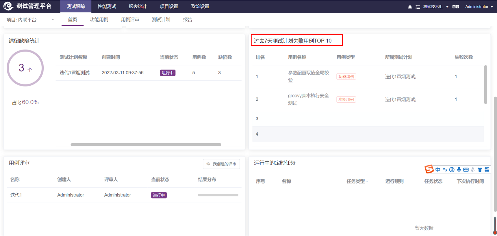
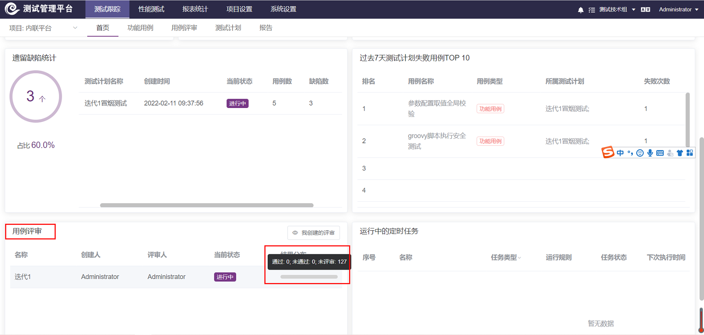
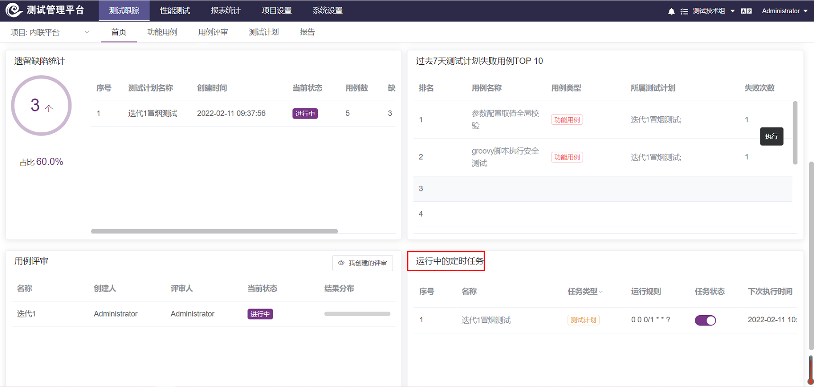

测试跟踪的首页主要用于展示现有项目的用例数量、关联用例数量、用例维护人分布、以及过去7天测试计划失败用例TOP 10、运行中的定时任务等信息。

###用例数量统计

!!! info "说明"
    * 根据「用例等级」进行已有功能用例统计；
    * 本周新增：点击可跳转至用例列表，展示本周新增的用例列表。统计：「功能用例」创建时间从周一0点开始；
    * 未评审：  点击可跳转至用例列表，展示未评审用例列表；
    * 未通过：  点击可跳转至用例列表，展示未通过用例列表；
    * 通过：    点击可跳转至用例列表，展示通过用例列表；
    * 通过率：  已评审的功能案例/所有功能案例 * 100%。
   
###关联用例数量统计

!!! info "说明"
    * 统计已有功能用例，存在关联用例的数据；
    * 关联用例分为：性能用例；
    * 本周新增：点击可跳转至用例列表，展示本周新增关联的用例列表。统计：「功能用例」添加「关联用例」的时间从周一0点开始；
    * 未覆盖  ：点击可跳转至用例列表，展示未关联其它用例的用例列表；
    * 覆盖：    点击可跳转至用例列表，展示已关联其它用例的用例列表；
    * 覆盖率：  关联的功能案例/所有功能案例 * 100%。
    
###用例责任人分布

!!! info "说明"
    * 统计项目下已有用例，根据功能用例「责任人」进行统计。
    
###遗留缺陷统计

!!! info "说明"
    * 统计存在缺陷的测试计划，按照测试计划创建时间倒叙排序；
    * 通过率计算：按照pass状态的用例/总用例*100%， 总用例：包含功能用例，已关联+场景、接口、压测用例总个数；
    * 占比计算：遗留总缺陷数/含遗留缺陷的所有测试计划的总用例数*100%。
    
###过去7天测试计划失败用例TOP 10

!!! info "说明"
    * 数据查询：当天向前推6天，0点开始计算，按照`测试用例`关联到`测试计划`的创建时间进行筛选，且执行状态为失败，只记录10条；
    * 用例名称：点击用例名称，可跳转至`功能用例`-当前用例的编辑页面；
    * 用例类型：目前只统计`功能用例`；
    * 所属测试计划：点击所属测试计划，跳转至`测试计划`明细页面。
    
###用例评审

!!! info "说明"
    * 默认展示评审人包含当前用户的`用例评审`记录；
    * 我创建的评审：点击`我创建的评审`，展示创建人为当前用户的`用例评审`记录；
    * 待我评审：点击`待我评审`，展示评审人包含当前用户的`用例评审`记录；
    * 结果分布：统计`通过`、`未通过`、`未评审`用例数量。
    
###运行中的定时任务

!!! info "说明"
    * 展示所有运行中的定时任务；
    * 可通过任务状态，进行关闭定时任务，关闭后，此处不再展示。