测试用例，主要用于对功能用例进行统一管理，支持用例的快捷创建及导入导出操作。
!!! info "测试用例规范"
    * 测试用例名称: 简洁、准确，完整，揭示用例实质；
    * 测试前置条件：说明数据来源、数据生成的方式；
    * 测试步骤：写明操作步骤；
    * 期望结果：无标记，紧跟S后面。注意：如S后面无期望结果，也可以支持；
    * 预期结果： 如果是页面校验写清需要校验哪些（字段、样式、提示信息），如果涉及到后台的需要写清楚涉及的表以及表中状态的变更；
    * 标签分类同步：接口用例、页面用例、用例、模块、备注、前置条件；
    * P0:冒烟用例（系统的基本功能：用例数要做控制，一般占总用例10%左右，优先级第一）；
    * P1:流程用例（主流程、分支流程、业务逻辑）；
    * P2:接口用例：渠道接口、接口字段校验（字段必填项、枚举、长度、类型）、接口流程校验、接口返回校验；
    * P3:异常用例（异常场景测试案例包括超时、三方调用场景、并发场景、大数据、redis、mq）；
    * P4：页面用例：主要就是页面校验、页面样式、页面联动性、页面功能。
 
入`测试用例`界面。左上方显示当前项目，项目下方显示此项目的全部测试用例模块。所属某一项目的测试用例以模块为单位进行统一管理，页面右侧显示选定模块下的测试用例列表，支持对测试用例进行新建、查询、编辑、复制、删除等操作。

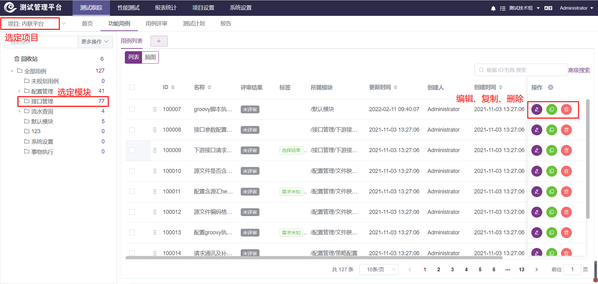

## 模块树管理

每个用例都需要属于一个特定模块，在创建用例前需要先规划并创建模块树。

### 切换项目

在模块树上方的项目切换下拉菜单中进行项目切换，展示所属该项目下的用例列表。

!!! info "说明"
    不同项目间模块树相互独立，当切换项目后需要重新创建模块树。

### 创建一级模块

选中模块树列表`全部用例`，点击`+`号按钮在模块总目录下创建一级模块。选中任意上级模块即可在该模块下创建次级模块。

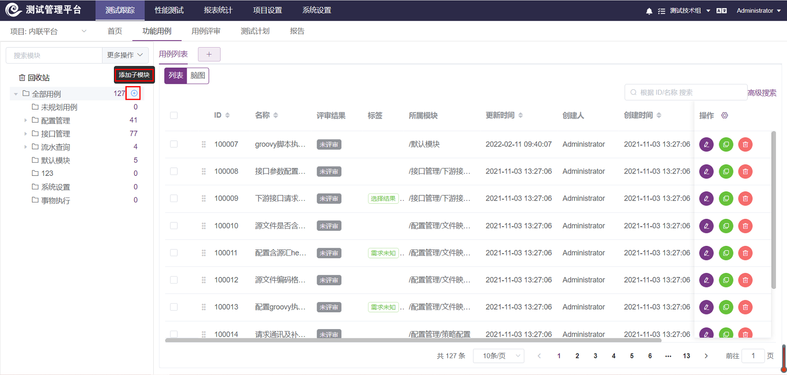

!!! info "说明"
    模块树支持最多 8 层的树状结构。

### 模块操作

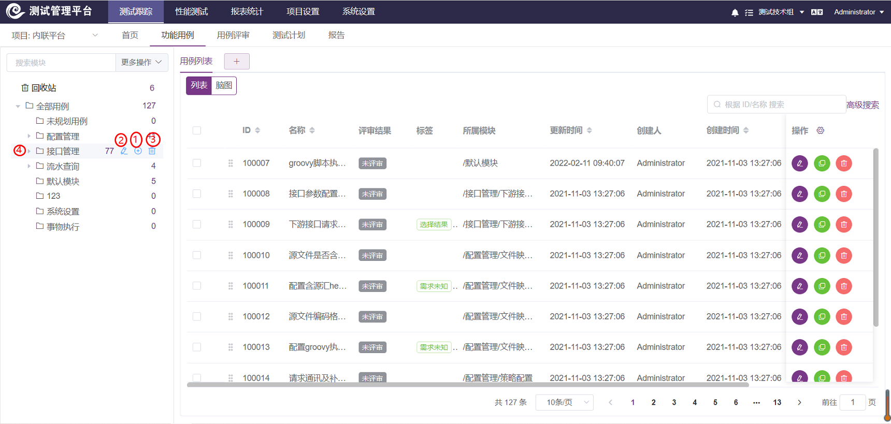
!!! info "操作说明"

    1. `重命名` 按钮，鼠标悬停在要操作的模块时出现，点击可以重命名该模块。
    2. `添加子模块` 按钮，鼠标悬停在要操作的模块时出现，点击可以在该模块下添加子模块。
    3. `删除` 按钮，鼠标悬停在要操作的模块时出现，点击将删除该模块和其所有子模块。
    4. `展开/收起` 操作，当模块下存在子模块时出现，点击将展开/收起该模块下的所有子模块。

!!! error "注意"
    删除某个模块不仅会删除该模块及其所有子模块，被删除模块中的接口及接口用例也将被移入回收站中，请谨慎使用该功能。

模块树还支持鼠标拖拽操作，用户可以根据需求调整模块顺序及其层级关系。

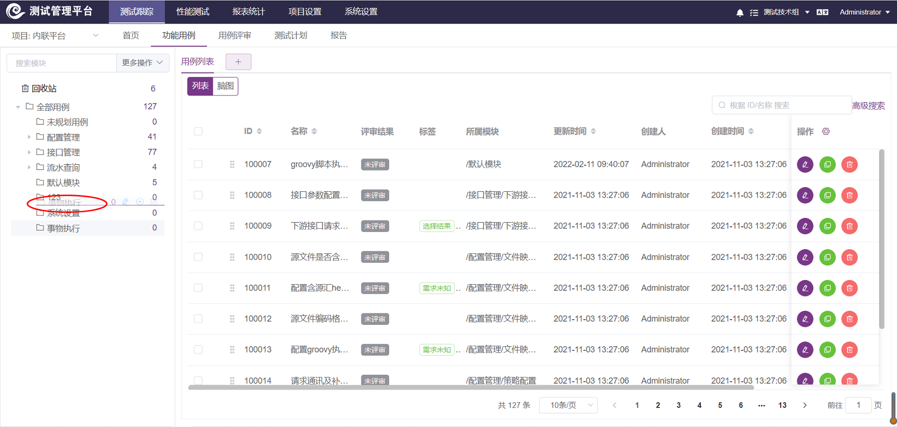

##用例管理

###切换用例视图

目前，平台提供两种用例呈现方式，进入`测试用例`页面后，默认打开`列表`视图，点击`脑图`标签切换至脑图视图。

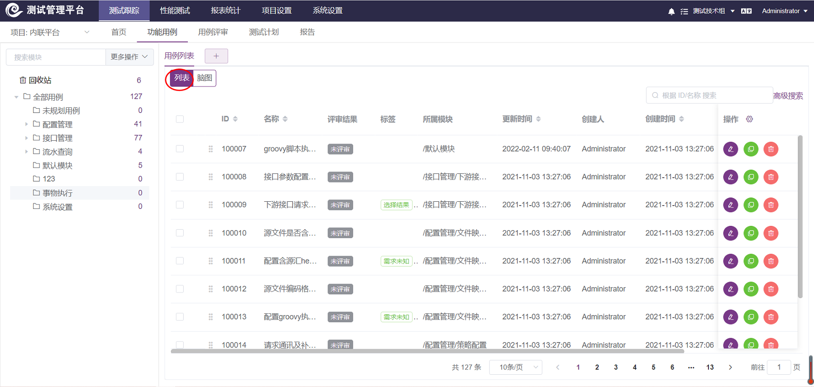

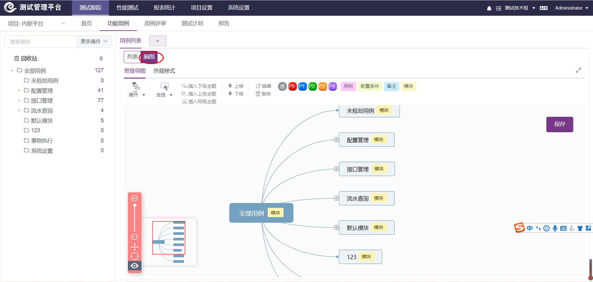

### 基于列表视图新建用例

选择新建用例所属模块，点击模块树上方`更多操作`下拉菜单选择`新建用例`。

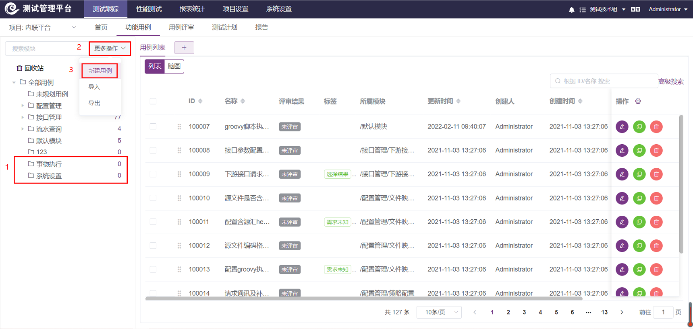

在弹出的`新建用例`页面中编辑用例基础信息，点击`确认`保存至用例列表；用户也可以直接点击`编辑详情`进入用例详情页面进行编辑。

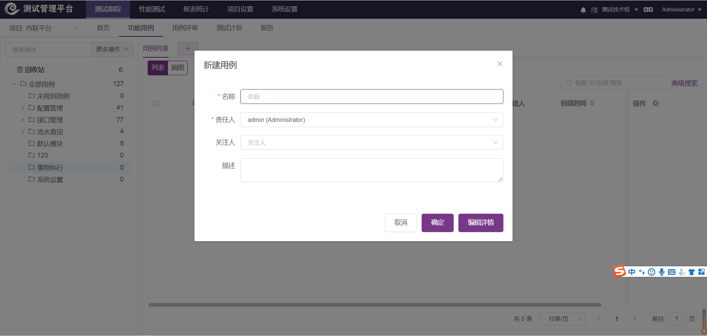

选定新建用例所属模块后，同时支持用户在用例列表视图点击`+`按钮直接进入新建用例详情页面，填写基础信息后即可将用例保存至用例列表。

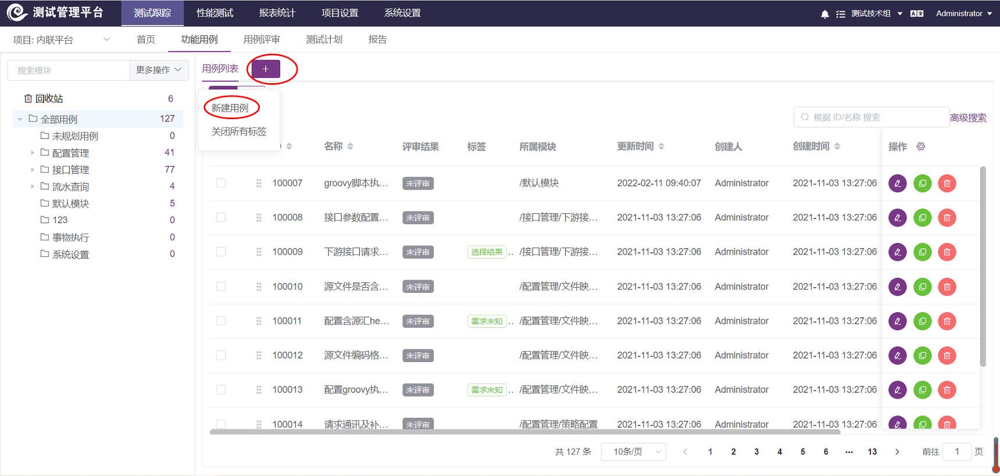

在新建用例详情页面中，进一步填写用例步骤信息，为用例添加备注、附件和评论，支持为用例关联测试、关联缺陷、关联缺陷。编辑完成后，点击`保存`将此条用例保存至列表。

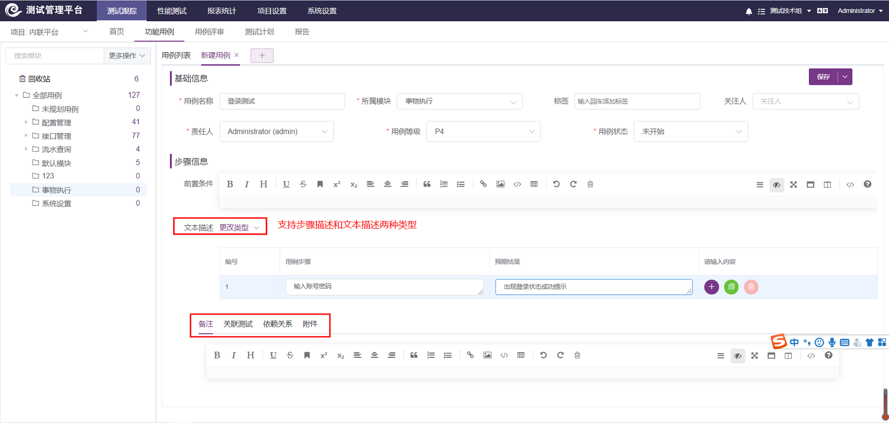

新建用例将在用例列表中呈现，点击此条用例或点击此条用例后的`编辑`按钮可重新进入用例详情页面进行编辑。

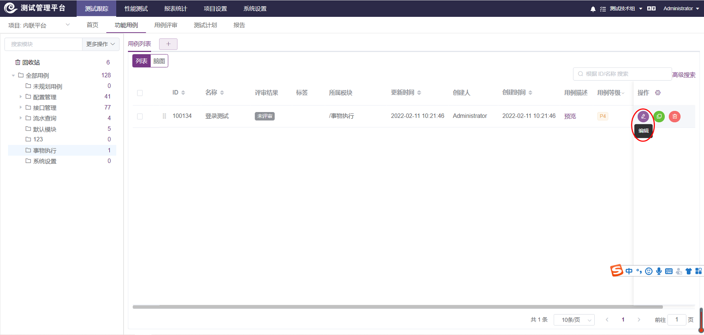

####  为用例关联测试 

新建测试用例可以和平台已有的性能测试用例进行关联。进入测试用例详情页面，点击`关联测试`标签，选择希望与本条用例进行关联的用例关联测试测试类型，进入该类型的用例列表进行关联。

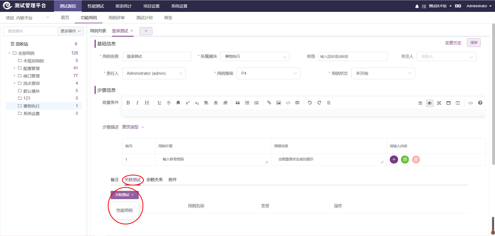

以性能测试用例为例。进入性能测试用例列表，选中希望关联的用例，点击`确认`完成添加。

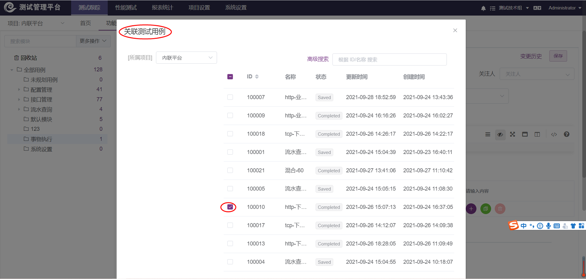

!!! info "说明"
    * 如果该项目下的性能测试用例，已经被其它用例关联，此处的列表中不再展示；
    * 此功能，与「测试计划」-「关联测试用例」-「同步添加关联的性能测试」存在关联关系。
    
!!! info "扩展"
    * 此处「功能用例A」关联了「性能测试用例B」后，在「测试计划」-关联要测试的功能用例时：
    * 如果选择了「功能用例A」，且勾选「同步添加关联的性能测试」，则「性能测试用例B」也被加入到测试计划中；
    * 如果选择了「功能用例A」，未勾选「同步添加关联的性能测试」，则「性能测试用例B」不被加入到测试计划中。

关联后的测试用例将在关联列表中显示，可以使用`锁定`按钮快捷取消关联。

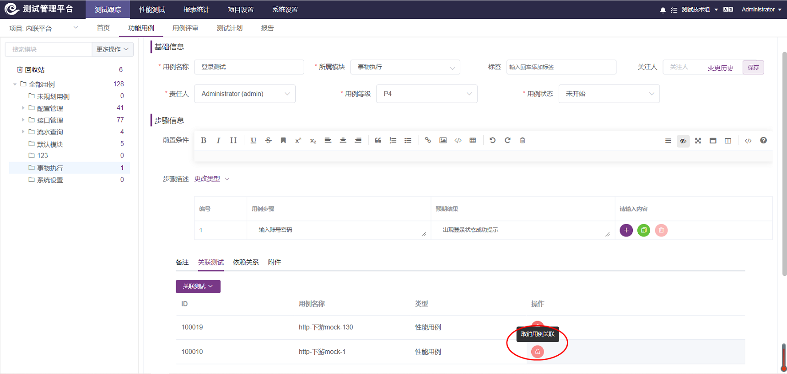

####  为用例关联需求 

新建测试用例可以和需求关联。点击`关联需求`标签，下拉选框中选择希望与本条用例进行关联的需求。

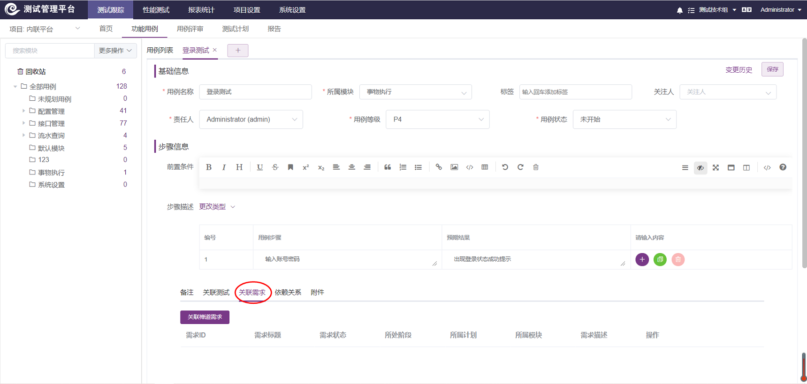

!!! error "注意"
    只有项目所在的「工作空间」-「服务集成」中集成了禅道平台，并且在「项目信息」中设置了「禅道产品ID」，「关联需求」标签才展示。
    「工作空间」-集成「禅道平台」详见 [禅道服务集成](../system_management/workspace.md#_3)。
    「项目信息」设置「禅道产品ID」详见 [禅道关联项目](../system_management/workspace.md#_3)。

点击`关联禅道需求`按钮，跳转至`关联需求`页面。

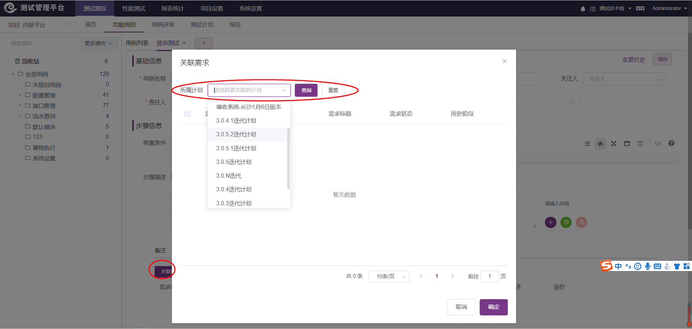

选择`所属计划`，点击查询按钮，展示`所属计划`下的所有禅道需求。

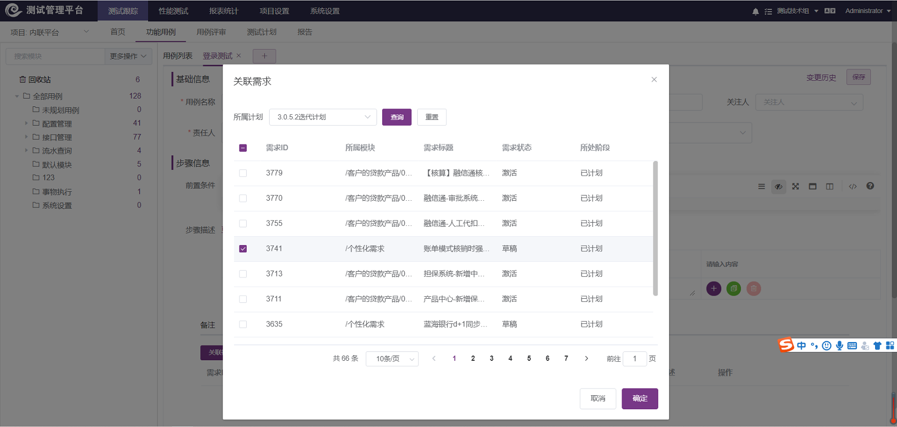

选择1条记录，点击`确定`按钮，完成关联需求。

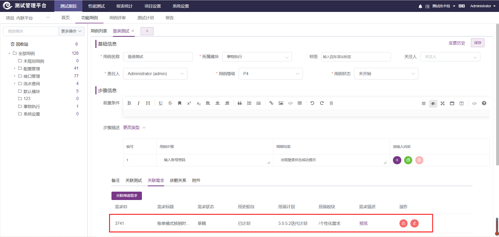

!!! error "注意"
    每条 功能用例 只能关联1条需求。
    
所属计划 对应了 禅道系统 中关联「产品」下的所有「计划」。示例：
    
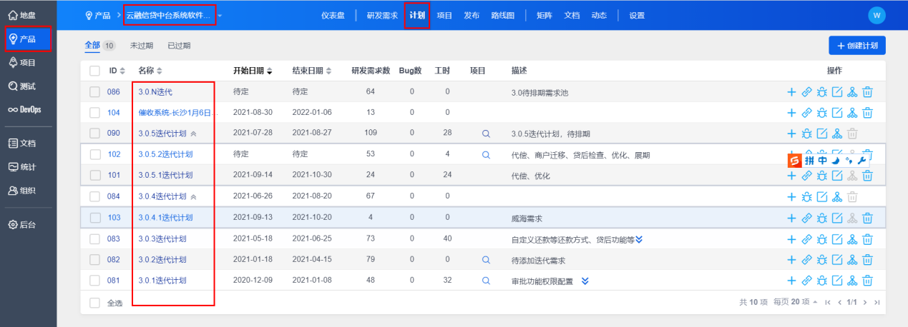

点击 `取消关联`按钮，用例与需求取消关联。

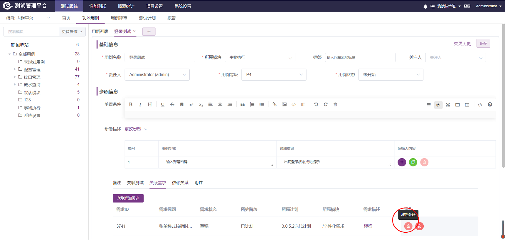

点击`详细信息`按钮，跳转至`禅道系统`对应的需求页面。

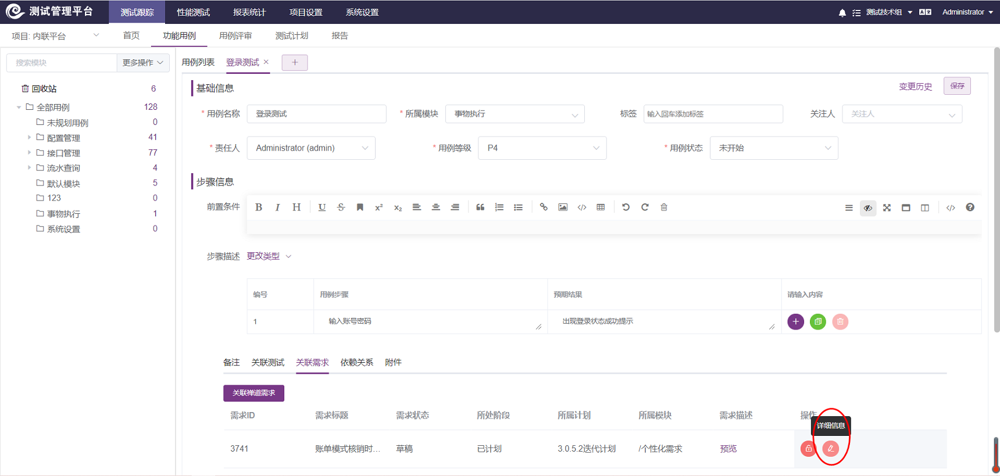

!!! info "说明"
    * 如果此时未打开「禅道系统」，点击「详细信息」按钮，跳转至「禅道系统」登录页面；
    * 如果此时已经打开且登录「禅道系统」，点击「详细信息」按钮，跳转至「禅道系统」对应的需求页面。

<!--
####   为用例关联缺陷 

新建测试用例可以和缺陷关联。点击`关联缺陷`标签，关联已有缺陷或创建新的缺陷并进行关联。

-->

####   为用例创建依赖关系 

#####  依赖关系设置 

系统支持用户，从测试的角度来设置该测试用例的前后置依赖测试用例。点击测试用例的`依赖关系`页签。

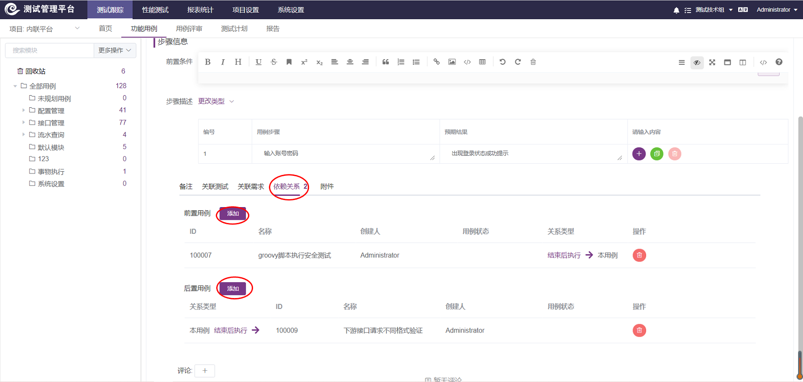

### 用例高级查询
在功能用例列表页面，提供了高级查询，不仅可通过ID和名称进行搜索，也可通过用例等级、类型、测试方式、评审状态等进行过滤筛选。
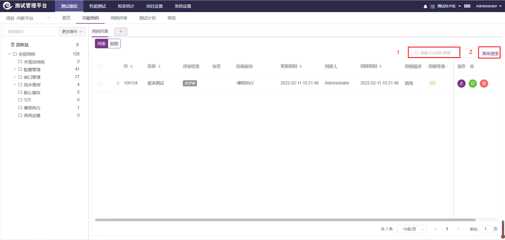

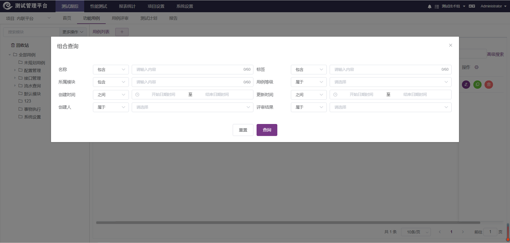

### 自定义列表显示信息
功能详细介绍及使用说明见 [通用功能->自定义列表显示](../../general/#_11)。

### 列表头功能
功能详细介绍及使用说明见 [通用功能->表头功能](../../general/#_8)。

### 基于脑图视图新建用例

在用例列表页面点击`脑图`切换以脑图形式展现用例。脑图父主题为模块名称，子主题为模块下测试用例，孙主题为测试用例步骤详情或备注信息。各级主题使用标签方式区分文本内容，支持使用标签方式标记用例优先级。

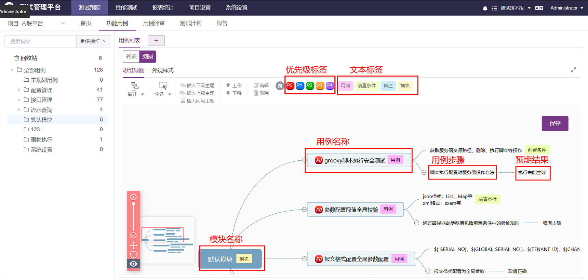

双击主题区域触发功能键，

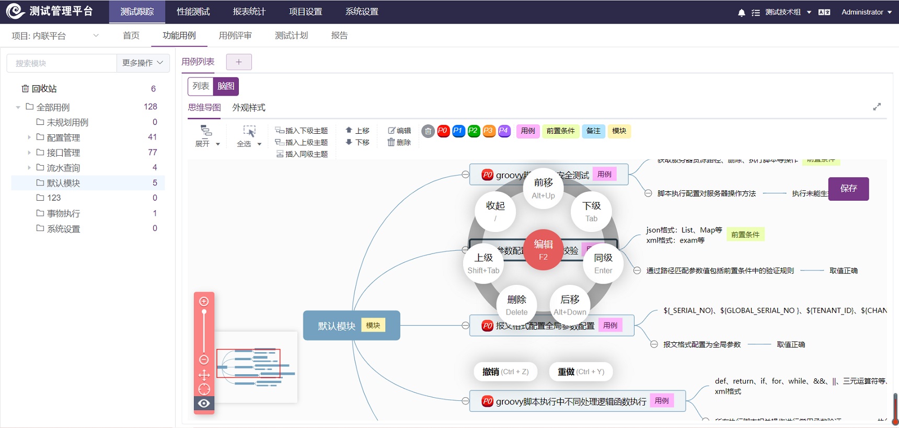

!!! info "操作说明"
    1. `收起` 按钮，点击可以收起该主题下属子主题。
    2. `上级` 按钮，点击创建该主题的上级主题。
    3. `下级` 按钮，点击创建该主题的下级主题。
    4. `同级` 按钮，点击创建该主题的同级主题。
    5. `后移` 按钮，点击将该主题移入其下级主题。
    6. `前移` 按钮，点击将该主题移入其上级主题。
    7. `删除` 按钮，点击删除该主题。
    8. `导出` 操作，支持导出全部模块及视图内全部已展开的用例。支持导出为json、png、svg、txt、md、mm等格式的文件。
    9. `优先级/标签` 操作，支持为该主题添加优先级及文本标签。
    
### 批量操作
具体操作请参考 [通用功能->批量操作](../../general/#_4)。
在列表对用例进行勾选，点击“…”按钮，可以对多条用例进行批量操作，包括批量编辑、批量移动、批量复制、批量删除等操作。
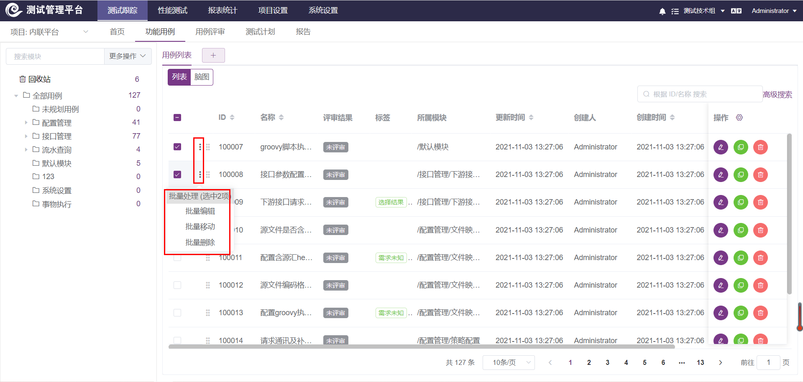
选择“批量编辑”，可以一次性统一为指定的测试用例，修改指定用例属性和属性值。

####   批量移动 
选择“批量移动”，可以一次性统一把指定的测试用例移到指定的模块下。

####   批量复制 
选择“批量复制”，可以一次性统一把指定的测试用例复制指定的模块下，见上图。
####   批量删除 
选择“批量删除”，可以一次性删除指定的所有测试用例。删除后的测试用例，可以到测试用例“回收站”里查看

### 导入用例

点击点击模块树上方`更多操作`下拉菜单选择`导入`。在弹出页面中切换表格文件或思维导图格式导入用例。

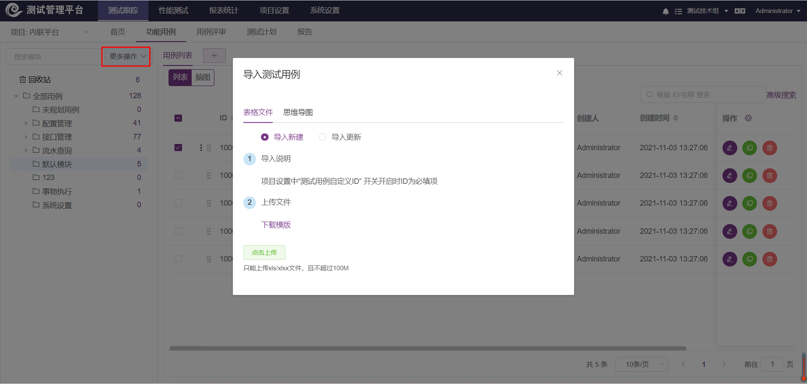

!!! info "操作说明"
    1. `导入新建` ，导入的用例自动保存为新用例。
    2. `导入更新` ，导入的用例自动覆盖已有用例。

### 导出用例

批量选中希望导出的测试用例，点击模块树上方`更多操作`下拉菜单选择`导出`，快捷导出Excel 格式的用例文件。

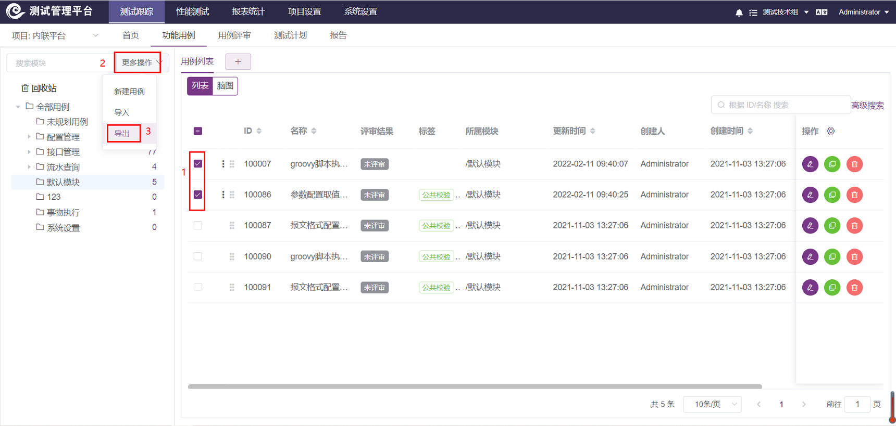

### 回收站
所有被删除的测试用例都会放在回收站里保存。
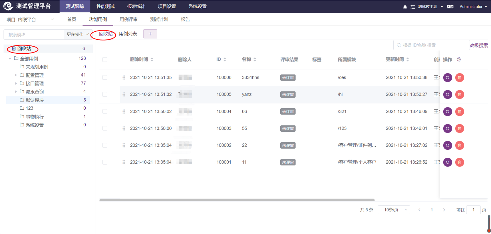

在回收站里再次删除或批量删除，这该用例才会真正被彻底删除。
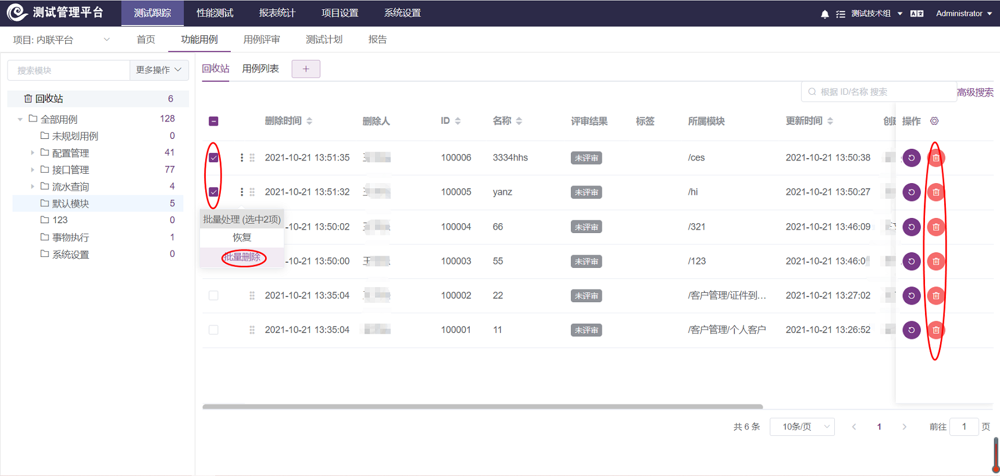

同时，可以恢复或批量恢复已经被删除的用例，相应的用例会自动回归到删除前的模块内。
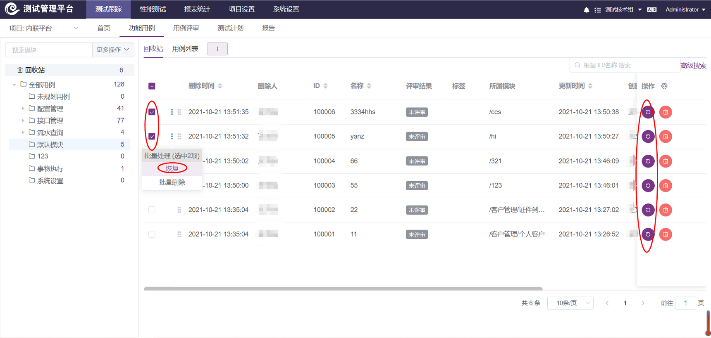

### 查看用例日志
在测试用例详情页面左上角【变更历史】，可以查看此用例所有的变更详情。
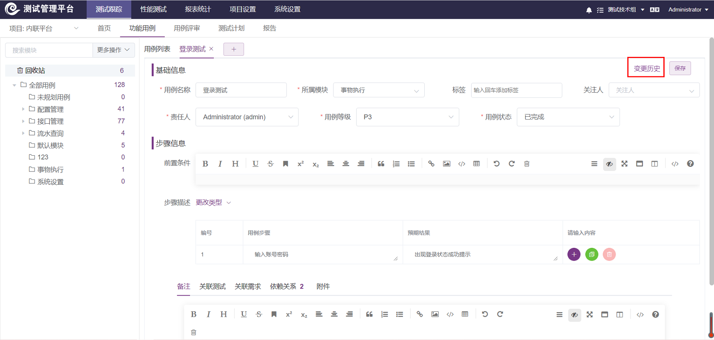

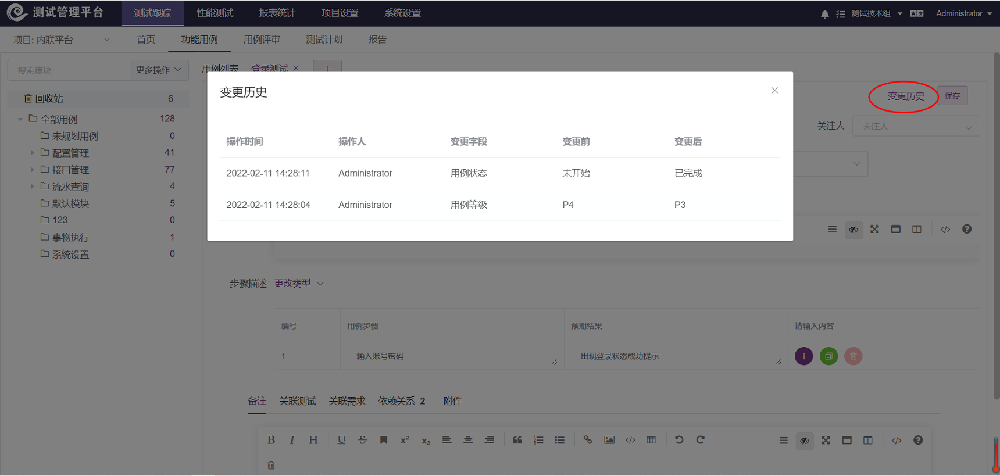

### 关闭标签
鼠标悬浮至`+`按钮，在触发的下拉框中点击`关闭所有标签`可一键关闭所有窗口。
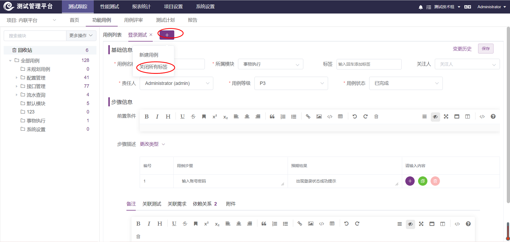

### 复制用例
在用例列表中点击`复制`按钮复制用例。
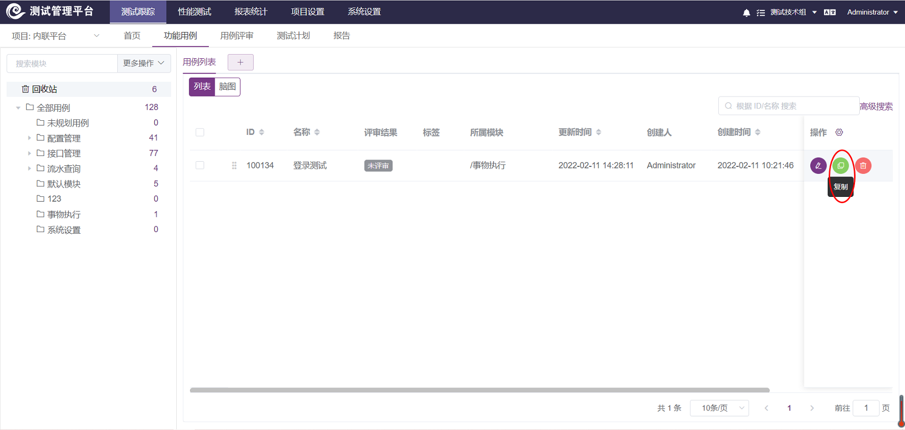

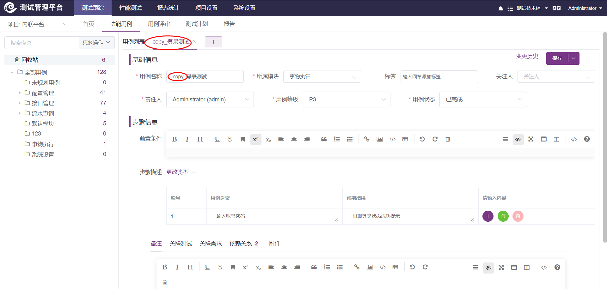

### 用例状态
用例状态：未开始、进行中、已完成。该状态只是针对用例本身，在`用例编辑`中通过手工修改才能更新。