测试计划属于某个项目，并可关联该项目下的测试用例。测试计划用于将测试各环节不同类型的测试任务添加到一个测试计划中，包括功能测试、接口测试和性能测试等，支持实时展示各测试环节的进度及测试情况，并实时生成测试报告。

## 新建测试计划

计入测试计划主页，显示该项目下全部测试计划，支持编辑测试计划、删除测试计划、查看测试计划报告、为测试计划设置定时任务等操作。

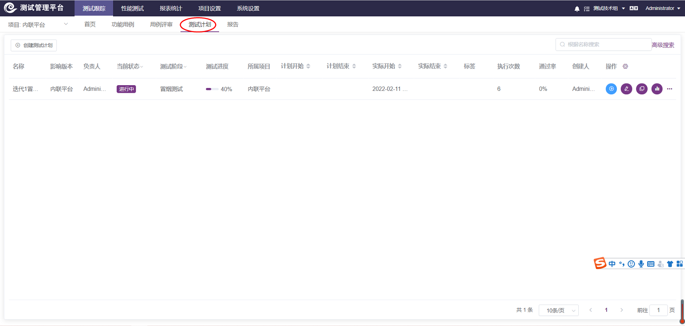

点击测试计划列表上方的 `创建测试计划` 按钮，在弹出页面中编辑测试计划的基础信息，点击`确认`保存至测试计划列表，用户可以在测试计划主页点击选定计划的`编辑`按钮重新进入编辑窗口。在计划创建页面，点击`规划&执行`将直接进入测试计划执行主页。
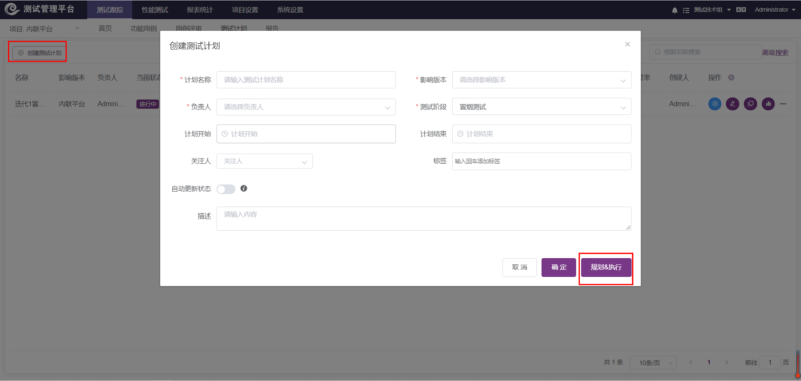

!!! info "当前状态说明："
    1. 已完成：表示计划中所有的测试用例都通过了。
    2. 已结束：表示计划中执行结果有失败的，但是都执行完了。
    3. 此状态可由系统自动更新，也可以手动维护，手动改状态只是改测试计划的状态，里面的用例状态不会判断，也不会修改。

####  测试计划-影响版本 	

新建测试计划时，需要选择`影响版本`,`影响版本`下拉列表数据，是从JIRA平台中获取：当前项目关联的JIRA项目中配置的影响版本。如当前项目未关联JIRA平台，选择‘无’即可。
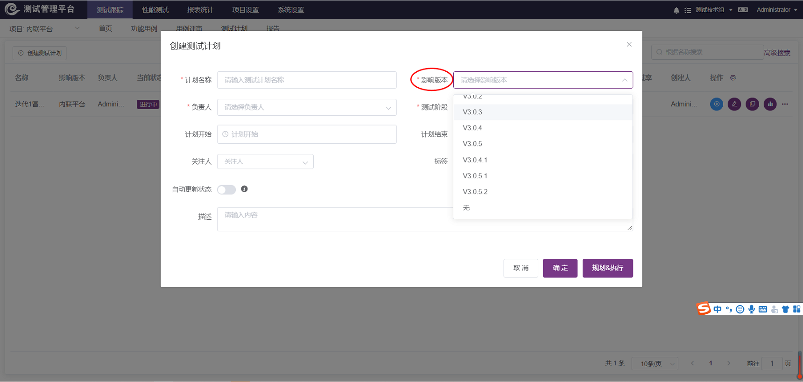

对应JIRA平台，发布版本示例：
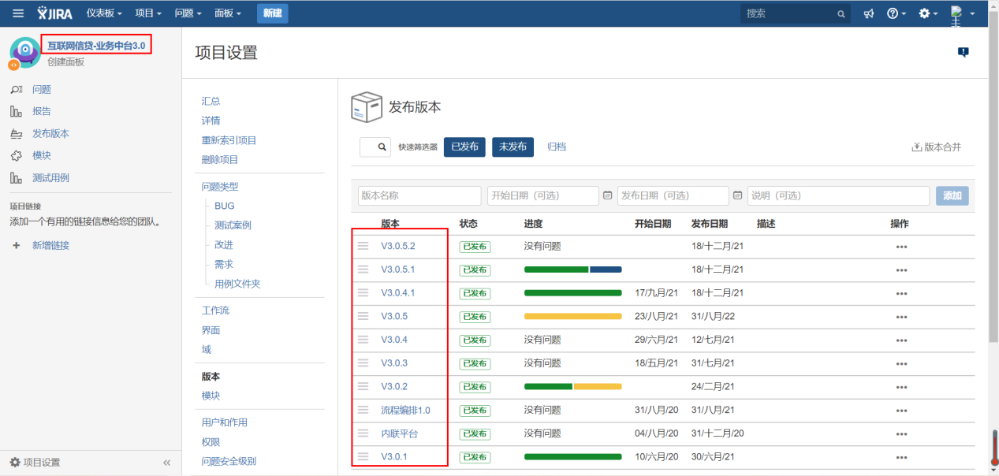

####  关联功能用例 	

进入测试计划执行主页，默认打开功能测试用例标签。点击`关联测试用例`支持为测试计划关联功能用例，同时支持用户快速切换`我的用例`或`全部用例`列表。

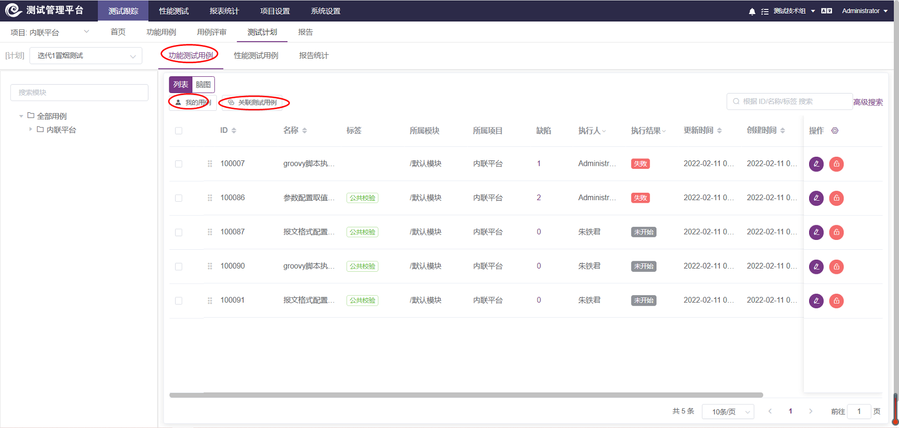

点击`关联测试用例`，展示关联测试用例界面，展示当前项目下，未被当前测试计划关联的测试用例列表，点击`确定`保存。
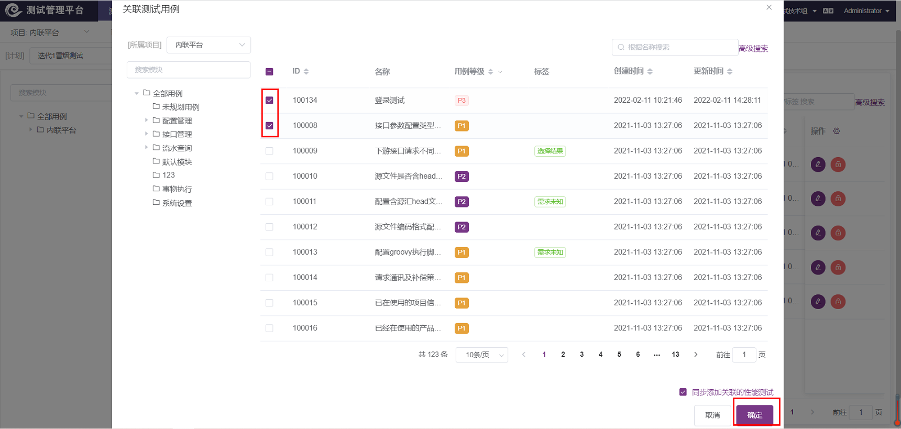

####  同步添加关联的性能测试 	
用例的`关联测试`中已经关联的性能测试用例。
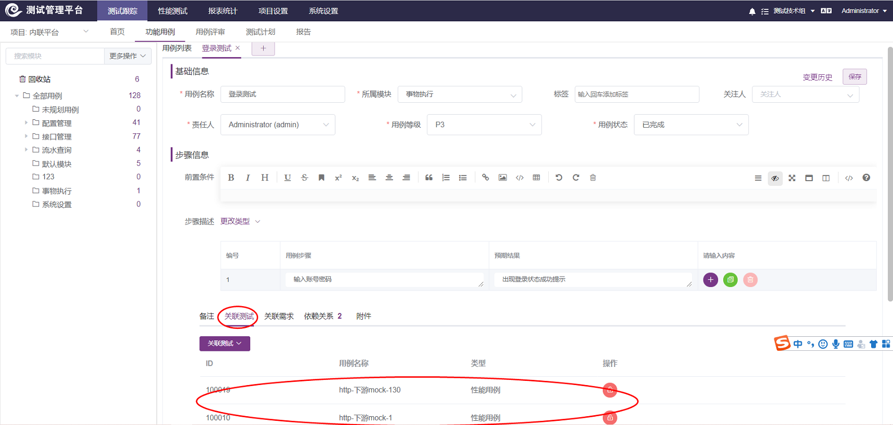

在`关联测试用例`界面，选中该用例，并勾选`同步添加关联的性能测试`。
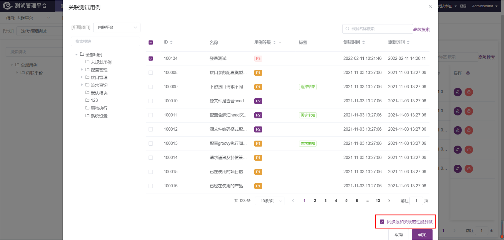

`功能用例`被关联的同时，该功能用例`关联测试`中的`性能测试用例`，也被加入到测试计划中，在`性能测试用例`中展示。
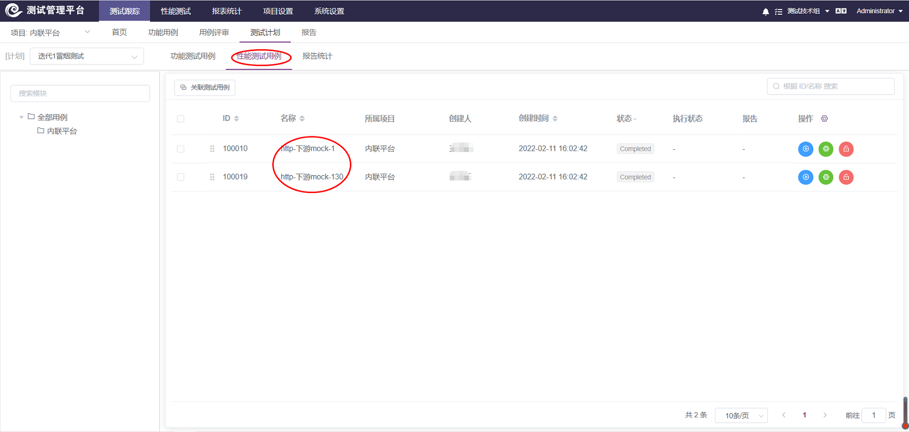

反之，如未勾选`同步添加关联的性能测试`，则只有`功能测试`被关联到`测试计划`中。

####  列表模式执行用例 

功能测试用关联完成后，点击任意功能测试用例的`编辑`按钮，进入用例详情页面。在执行步骤中，填写每一步的实际结果及该步的执行结果，基于各步骤执行情况及评定标准，点击上方的状态按钮为此条用例标记执行状态。
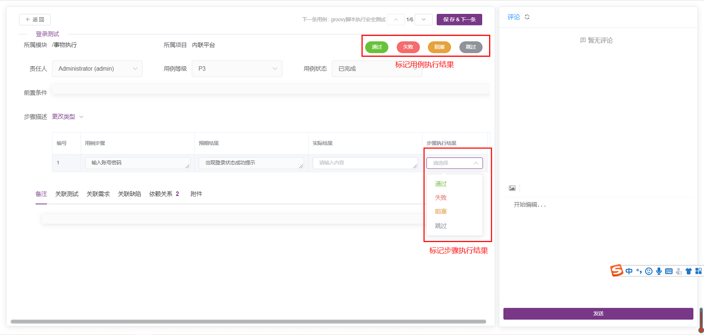

####  脑图模式执行用例 

与用例的创建和评审类似，用例执行结果同样可以通过脑图方式记录。在用例列表页面点击 `脑图` 切换到脑图展示模式，选中待执行用例，通过添加标签的方式来标记用例执行结果。
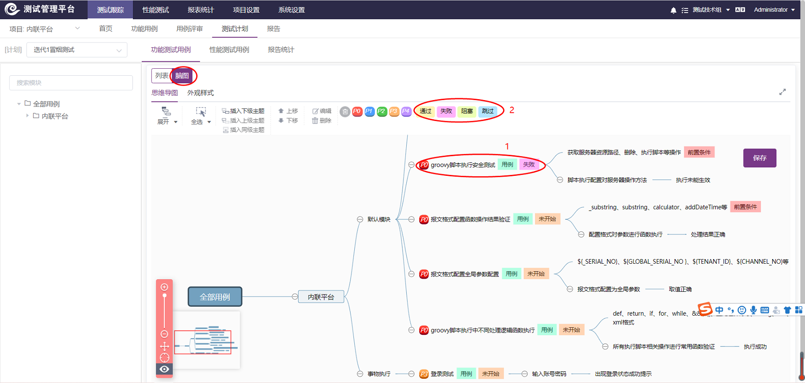

<!--
#### 为测试计划关联接口用例 		

切换至`接口测试用例`标签视图，支持用户为测试计划关联接口测试用例。用户可以在该页面发起单用例的快速执行、查看单用例执行结果，同时支持批量取消关联、批量执行等操作，目前平台支持以并行或串行方式批量执行接口测试用例。此外，用户还可以通过批量编辑快捷更改接口用例运行环境。

-->

#### 测试用例查看关联需求 	
在测试用例执行页面，可以点击`关联需求`，查看该用例关联的禅道需求。只能查看，不能取消关联。
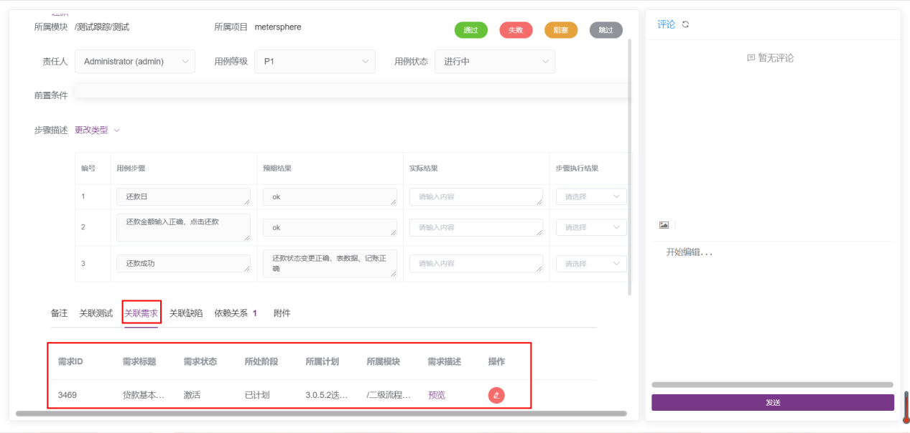
!!! error "注意"
    只有项目所在的「工作空间」-「服务集成」中集成了禅道平台，并且在「项目信息」中设置了「禅道产品ID」，「关联需求」标签才展示。
    「工作空间」-集成「禅道平台」详见 [禅道服务集成](../system_management/workspace.md#_3)。
    「项目信息」设置「禅道产品ID」详见 [禅道关联项目](../system_management/workspace.md#_3)。
    
#### 测试用例关联缺陷 	
- 关联缺陷

在测试用例执行页面，可以点击`关联缺陷`，对该用例关联的JIRA缺陷。
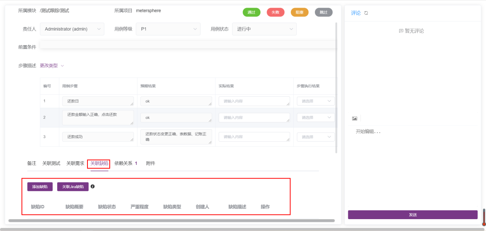
!!! error "注意"
    只有项目所在的「工作空间」-「服务集成」中集成了JIRA平台，并且在「项目信息」中设置了「JIRA项目key」，「关联缺陷」标签才展示。
    「工作空间」-集成「JIRA平台」详见 [JIRA服务集成](../system_management/workspace.md#_2)。
    「项目信息」设置「JIRA项目key」详见 [JIRA关联项目](../system_management/workspace.md#_2)。
    
点击`关联JIRA缺陷`按钮，跳转至`关联缺陷`页面。
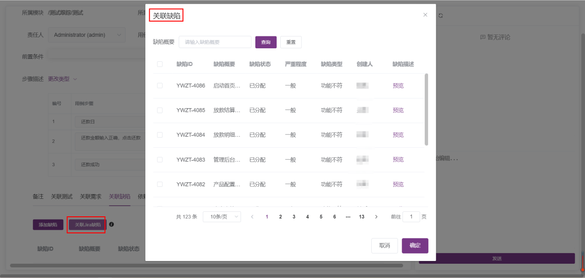

!!! info "关联缺陷列表数据来源说明："
    1. 当前「测试计划」的「影响版本」，对应「JIRA项目」等于该影响版本的所有缺陷。
    2. 如果「测试计划」的「影响版本」为‘无’，则展示关联的「JIRA项目」的所有缺陷。

可以根据「缺陷概要」查询，也可直接选择缺陷，缺陷记录可以选择多条。
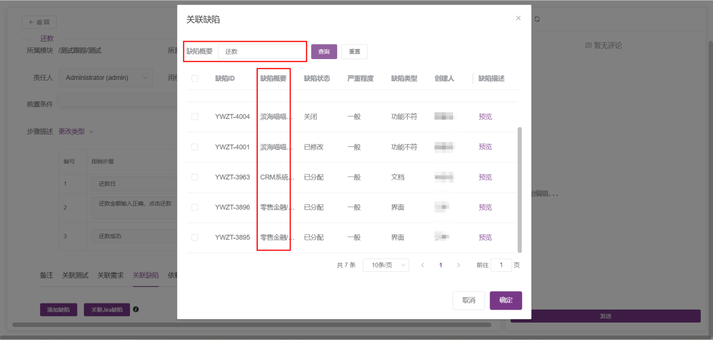

选择1条或多条记录，点击「确定」按钮，完成「关联缺陷」。
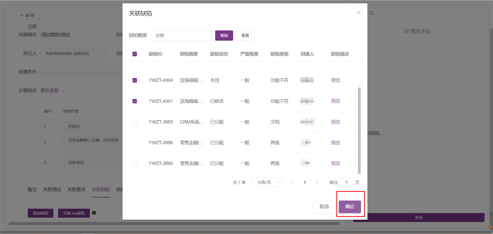
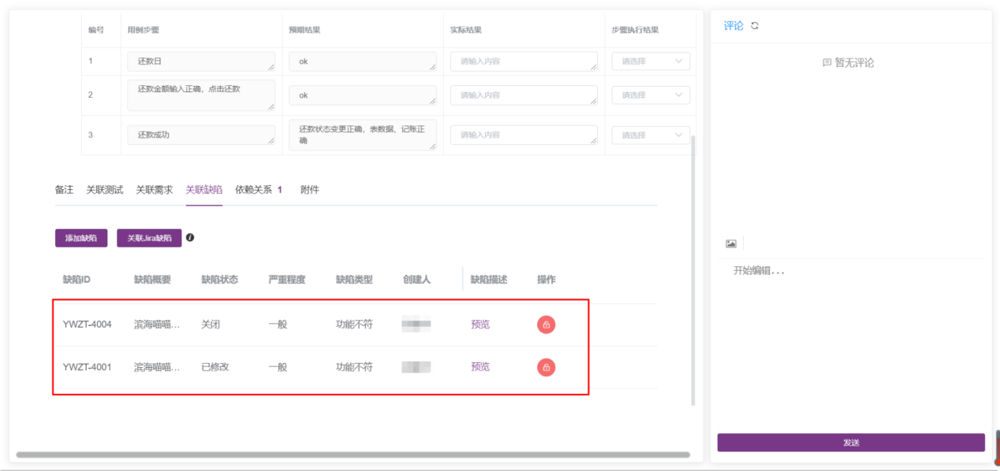

- 取消关联

点击 `取消关联`按钮，解除用例与缺陷的关联。
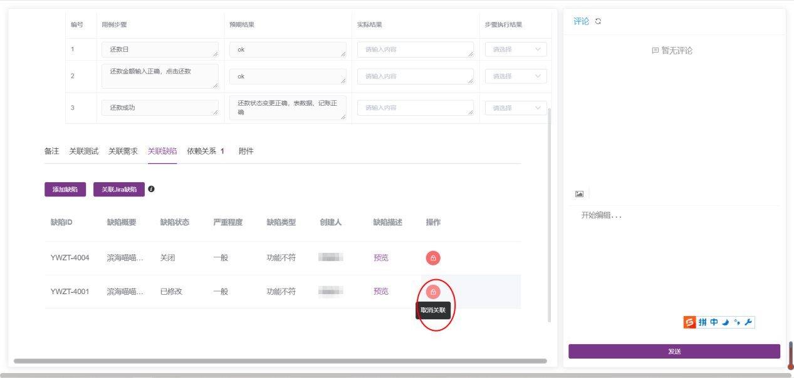

- 添加缺陷

点击 `添加缺陷`按钮，跳转至「JIRA系统」对应项目的缺陷列表。
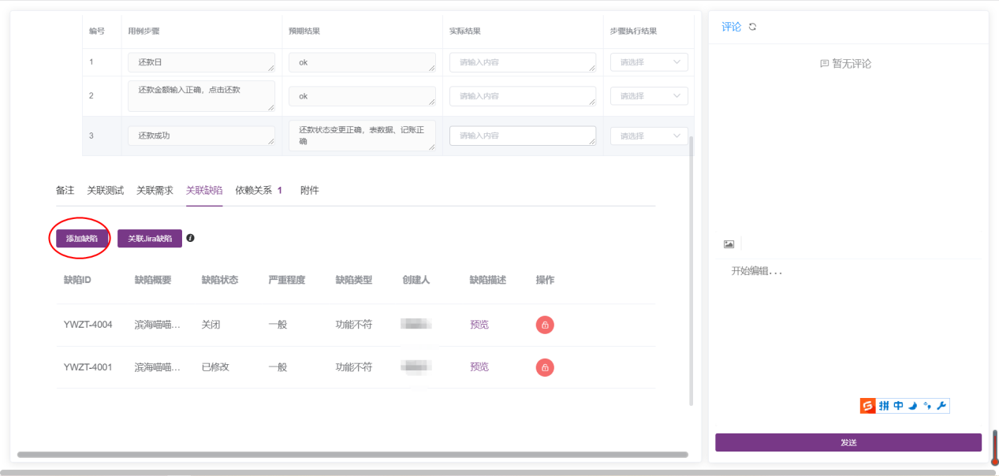
!!! info "说明："
    1. 如果此时未打开「JIRA系统」，点击「添加缺陷」按钮，跳转至「JIRA系统」登录页面。
    2. 如果此时已经打开且登录「JIRA系统」，点击「添加缺陷」按钮，跳转至「JIRA系统」对应项目的缺陷列表。

#### 为测试计划关联性能用例 		

切换至`性能测试用例`标签视图，支持用户为测试计划关联性能测试用例。用户可以在该页面发起单用例的快速执行、查看单用例执行结果，同时支持批量取消关联、批量执行等操作。目前，平台支持以并行或串行方式批量执行性能测试用例。

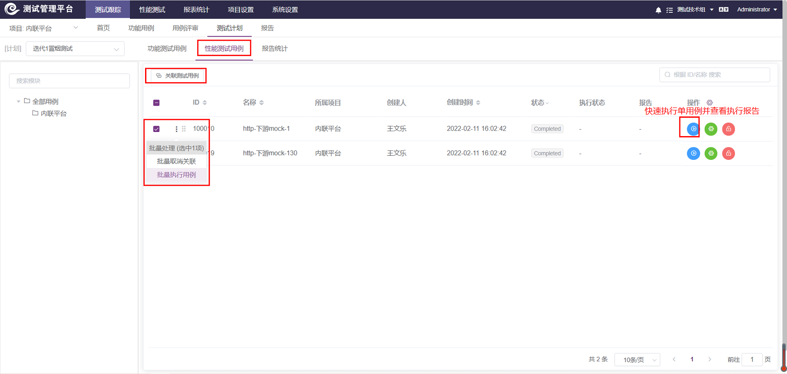

#### 报告统计 		

切换至`报告统计`标签视图查看本次计划的执行统计，支持分类型、分模块统计用例执行结果，展示失败用例及缺陷用例列表等。点击`保存`将本次计划执行报告存入测试跟踪报告中心，同时支持导出 PDF 格式报告。

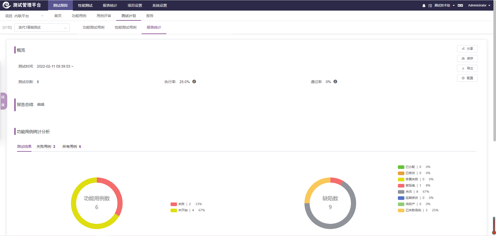

- 报告总结

点击`编辑`按钮进行内容编写，编写完成点击`保存`按钮，自定义测试报告内容。
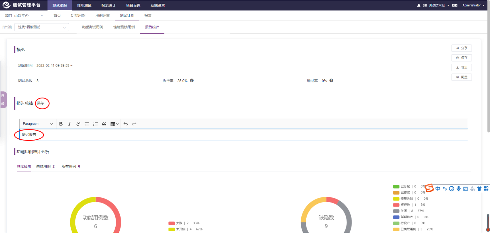

- 功能用例统计分析

点击`测试结果`展示功能用例数，缺陷数。
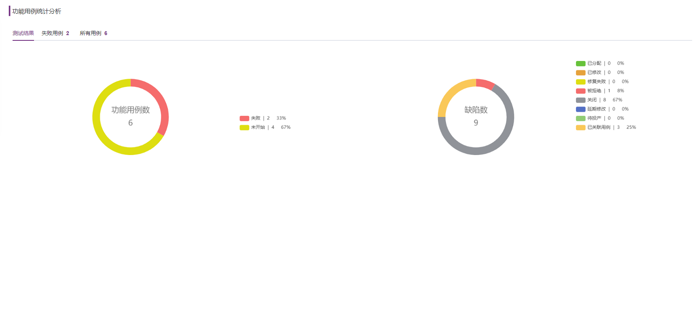

!!! info "缺陷数 说明："
    1. 统计的是当前项目关联的JIRA项目的缺陷；
    2. 如果「测试计划」选择了「影响版本」，统计的是JIRA项目对应影响版本下的缺陷；
    3. 如果「测试计划」选择了「影响版本」为‘无’，统计的是JIRA项目下所有缺陷；
    4. `已关联用例`，表示在该项目中，已与用例关联的缺陷数量。
    
点击`失败用例`标签，展示当前`测试计划`的失败用例列表。
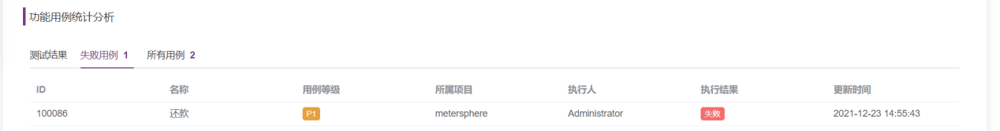

点击`所有用例`标签，展示当前`测试计划`的所有用例列表。
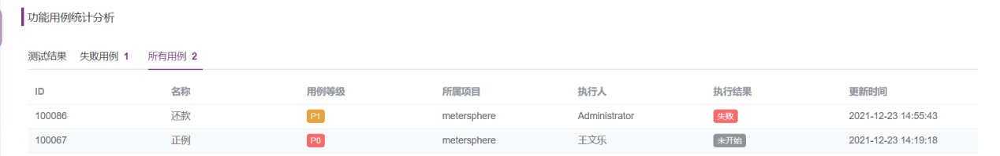

点击`分享`按钮，可将链接`复制`分享。
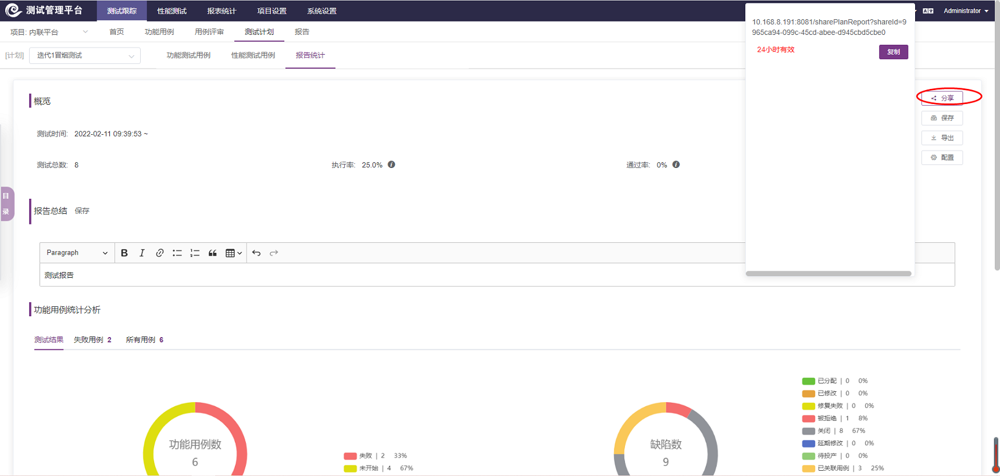

点击`保存`按钮，该报告才会在`测试跟踪`-`报告`列表中展示。
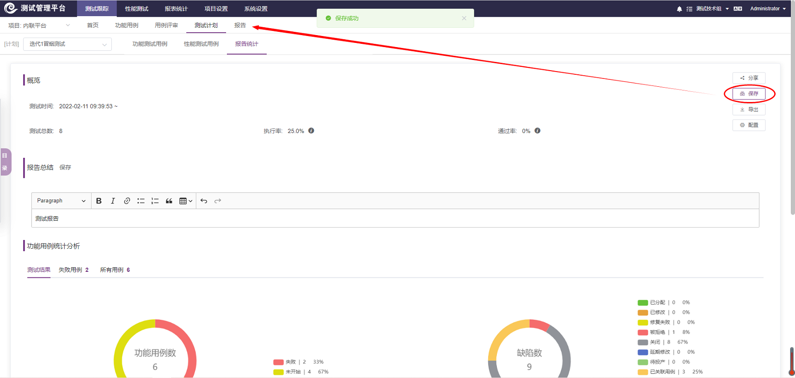

点击`导出`按钮，导出html格式的报告。
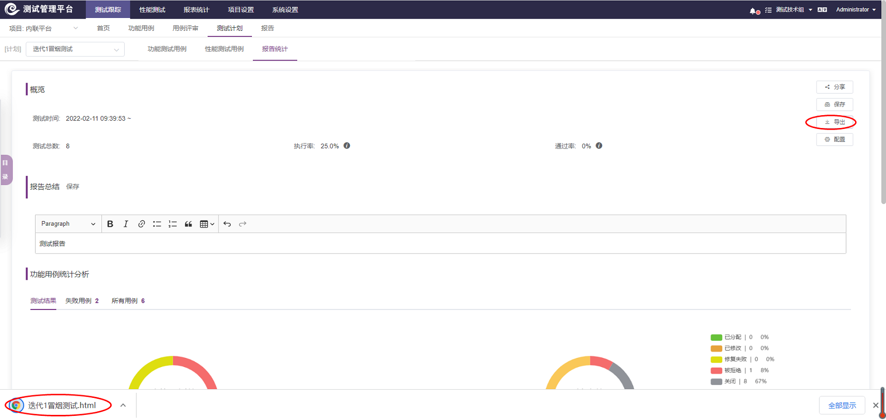

点击`配置`按钮，可以根据需要进行自由配置报告要展示的内容。
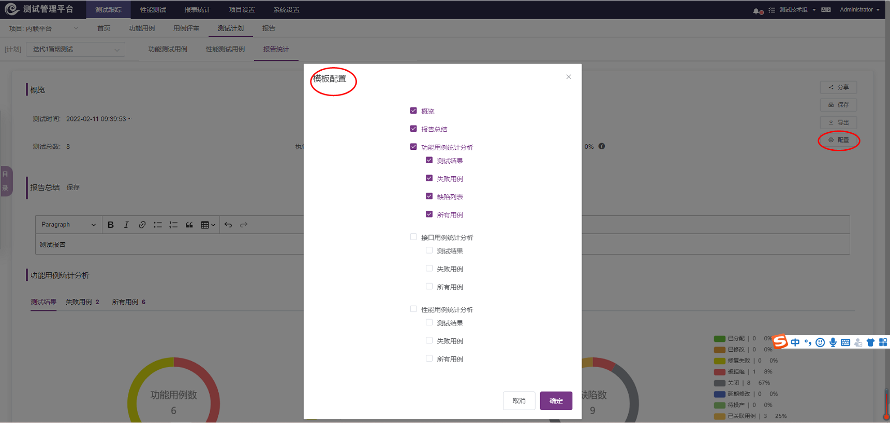